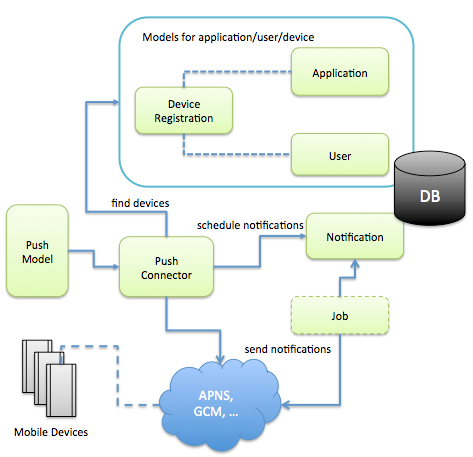

# LoopBack Push Notification

This module provides a set of LoopBack models to enable mobile device push notifications.

Please see the full documentation: [Creating push notifications](http://docs.strongloop.com/display/DOC/Creating+push+notifications).

## Architecture

## Key Components

* Device model and APIs to manage devices with applications and users
* Application model to provide push settings for device types such as ios and
android
* Notification model to capture notification messages and persist scheduled
notifications
* Optional Job to take scheduled notification requests
* Push connector that interact with device registration records and push
providers such as APNS, GCM, and MPNS.
* Push model to provide high level APIs for device-independent push notifications

## Samples

### Node.js server

An [example LoopBack server application](/example/server) is provided.  To run

To run it:

    cd example/server
    node app

Open your browser to [http://127.0.0.1:3010](http://127.0.0.1:3010).

By default, the app uses an in-memory store for the application/installation data.
To change to a MongoDB instance, set the MONGODB environment variable to the MongoDB URL. For example,

    MONGODB=mongodb://localhost/demo node app

### iOS client

The [iOS example app](/example/ios) uses LoopBack the LoopBack iOS SDK to enable
and handle push notifications. 

### Android client

The [Android example app](/example/android) uses LoopBack Android SDK to enable
and handle push notifications. 

## References

- https://developer.apple.com/library/ios/documentation/NetworkingInternet/Conceptual/RemoteNotificationsPG/Chapters/ApplePushService.html
- http://developer.android.com/google/gcm/index.html
- http://msdn.microsoft.com/en-us/library/windowsphone/develop/hh202945(v=vs.105).aspx
- https://github.com/argon/node-apn
- https://github.com/logicalparadox/apnagent-ios
- https://blog.engineyard.com/2013/developing-ios-push-notifications-nodejs

